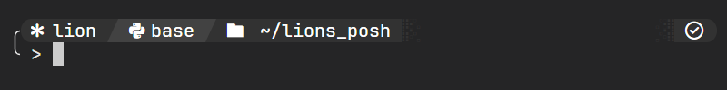

# lions_posh
My own custom terminal prompt. Currently, this is what I use for my work with [WSL](https://en.wikipedia.org/wiki/Windows_Subsystem_for_Linux).

### Themes
#### Minimal


#### Light (WIP)


#### Dark (WIP)


## Contents
- [Contents](#contents)
- [Installation](#installation)
- [Segments](#segments)
- [License](#license)


## Installation
This prompt requires that you download and install two things:

### Oh My Posh
Instructions for installation can be found [here](https://ohmyposh.dev/).

Make sure to add the following line to your `~/.bashrc` file:
```shell
eval "$(oh-my-posh init bash --config 'https://raw.githubusercontent.com/Lion4567714/lions_posh/master/themes/minimal.toml')"
```

Replace the `minimal.toml` with any of my themes that you would like to use!

To ensure that the changes are put into effect, try using `$ exec bash`

### JetBrainsMono Nerd Font
Download can be found [here](https://www.nerdfonts.com/font-downloads). To install (for Windows computers), press the Windows key and type "Fonts". Drag the .ttf files into that box to add the font to your computer's fonts bank. 

Make sure to switch your terminal to using the JetBrainsMono Nerd Font, or else your prompt may end up with blank and/or unknown characters.


## Segments
The `minimal` theme is the most developed and up-to-date theme in this repository. This section is based around that theme, but other themes will have the same segments. This is just a brief description of what each segment is telling you...

### Name
Name of the current user

### Git
Name of the current Git branch. Only appears in Git repository directories.

### Python Environment
Name of the current Python environment. Especially helpful when working with [Conda](https://www.anaconda.com/download).

### Path
The path to the current working directory

### Status Code
Status of the previous executed command. Check mark if successful, red X if not.

### Battery
Current battery charge. Displays an up arrow if the device is currently charging and a down array if it is discharging. Only appears on applicable devices

### Update
If `oh-my-posh` has an update available, you will be made aware here. Otherwise, this section will not show up.

### Time
Self-explanatory!


## License
MIT License, Copyright (c) 2024 Anders Gilliland
